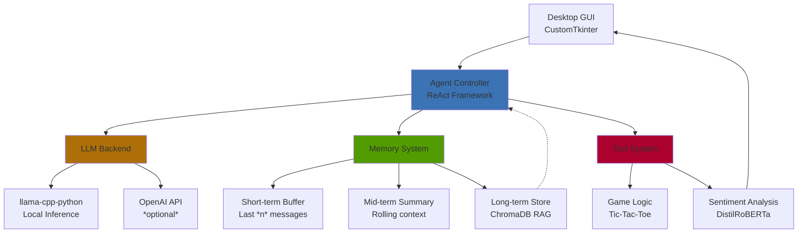

# LLM Agent System with Multi-Tier Memory Architecture

[](https://github.com/hzabun/llm-agent-rag-system/actions/workflows/ci.yml)
[](https://www.python.org/downloads/)
[](https://github.com/astral-sh/uv)
[](https://github.com/astral-sh/ruff)
[](LICENSE)

A conversational AI system demonstrating agentic capabilities through the ReAct framework, production-grade RAG architecture, and sentiment-adaptive UI. Features local LLM deployment with GPU acceleration, ChromaDB vector store for long-term memory, and multi-model orchestration.

**Core Capabilities:**

- 🤖 Tool-using AI agent (plays Tic-Tac-Toe via external tool execution)
- 🧠 Three-tier memory: buffer + summary + vector store (RAG)
- 💬 Local LLM deployment (llama-cpp-python) or OpenAI API
- 😊 Real-time sentiment analysis with UI adaptation
- 🎭 Character-based roleplay system with emotional modeling


## Description

An experimental conversational AI system exploring agentic capabilities, multi-tier memory architecture, and local LLM deployment. Implements the ReAct framework ([original paper](https://arxiv.org/abs/2210.03629), [quick-read article](https://www.promptingguide.ai/techniques/react)) for tool-using agents with production-grade RAG architecture.

Main conversational LLM can be run locally via [llama-cpp-python](https://github.com/abetlen/llama-cpp-python) or via the OpenAI API (needs an access key). Sentiment analysis is done via a [fine-tuned DistilRoBERTa-base](https://huggingface.co/j-hartmann/emotion-english-distilroberta-base) model and run via the [HF tranformers](https://huggingface.co/docs/transformers/en/main_classes/pipelines) library.

## System Architecture



**Key Components:**

- **Agent Controller:** ReAct-based reasoning loop for tool selection and execution
- **Memory System:**
  - Short-term: Conversation buffer (last n messages)
  - Mid-term: Rolling summary of conversation history
  - Long-term: ChromaDB vector store for semantic retrieval (RAG)
- **LLM Backend:** Local deployment via llama-cpp-python with GPU acceleration
- **Tool System:** Extensible framework for external capabilities (currently: game logic, board state management)
- **Sentiment Analysis:** Secondary DistilRoBERTa model for emotion detection and UI adaptation

## At a Glance

| Component       | Technology                          |
| --------------- | ----------------------------------- |
| Agent Framework | ReAct (reasoning + acting)          |
| LLM Backend     | llama-cpp-python / OpenAI API       |
| Vector Store    | ChromaDB (RAG architecture)         |
| Sentiment Model | DistilRoBERTa-base (fine-tuned)     |
| UI Framework    | CustomTkinter                       |
| Memory Strategy | Buffer + Summary + Vector Retrieval |
| Context Window  | 4096 tokens (managed)               |

## Technical Highlights

**Production-Grade RAG Implementation:**

- ChromaDB vector store for semantic memory retrieval
- Automatic embedding and storage of conversation history
- Context-aware prompt augmentation from long-term memory

**Multi-Tier Memory Architecture:**

- Persistent storage across sessions (JSON + vector DB)
- Automatic summarization to manage context window limits
- Semantic search for relevant historical context

**Local LLM Deployment:**

- CPU/GPU hybrid inference with llama-cpp-python
- Support for quantized models (Q5_K_M) for efficiency
- 4096 token context window management

**Agentic Capabilities:**

- ReAct framework implementation for tool-using behavior
- Dynamic tool selection and execution
- Multi-step reasoning with intermediate observations

**Multi-Model Orchestration:**

- Primary LLM for conversation and reasoning
- Auxiliary sentiment analysis model (DistilRoBERTa)
- Real-time UI adaptation based on emotion detection

### Features

- Chatbot can play a game of "Tic-Tac-Toe" with you by executing tools
- Chatbot takes the role of a specific character you can choose and acts as much as possible the way that character would act
- Specific character can be anyone from movies, video games, anime etc. (see "characters.json" for a list of characters I used)
- Image of character changes based on the characters current emotion (currently only implemented for Goku)


## Installation

### Prerequisites

- Python 3.10 or higher
- [uv](https://docs.astral.sh/uv/) package manager

### Setup with uv

1. Clone the repository:

```bash
git clone https://github.com/my-account/llm-agent-desktop-gui
cd llm-agent-desktop-gui
```

2. Install uv if you haven't already:

```bash
# macOS and Linux
curl -LsSf https://astral.sh/uv/install.sh | sh

# Windows
powershell -c "irm https://astral.sh/uv/install.ps1 | iex"
```

3. Install dependencies:

```bash
uv sync
```

4. **(Optional)** Set up pre-commit hooks for development:

```bash
uv run pre-commit install
```

## Usage

### Choosing Your LLM Backend

The application supports two backends, configured via the `LLM_BACKEND` environment variable.

#### Option A: OpenAI API (Default - Recommended for Quick Start)

1. Copy the example environment file:

   ```bash
   cp .env.example .env
   ```

2. Edit `.env` and add your OpenAI API key:

   ```
   LLM_BACKEND=openai
   OPENAI_API_KEY=your-api-key-here
   ```

3. Run the application:
   ```bash
   make run
   # or: uv run python main.py
   ```

#### Option B: Local LLM with llama-cpp-python (Advanced)

1. Install llama-cpp-python with GPU acceleration:

   ```bash
   # For NVIDIA GPUs with CUDA
   make install-llm-cuda
   # or: uv pip install llama-cpp-python --extra-index-url https://abetlen.github.io/llama-cpp-python/whl/cu121

   # For Apple Silicon (M1/M2/M3/M4)
   make install-llm-metal
   # or: CMAKE_ARGS="-DLLAMA_METAL=on" uv pip install llama-cpp-python

   # For CPU only (slower)
   uv pip install llama-cpp-python
   ```

2. Download a model (e.g., [Openhermes 2.5 Mistral 7B - GGUF](https://huggingface.co/TheBloke/OpenHermes-2.5-Mistral-7B-GGUF)) and place it in `src/llm_agent_gui/llm_weights/`

3. Copy the example environment file and configure it:

   ```bash
   cp .env.example .env
   ```

4. Edit `.env` to use local LLM:

   ```
   LLM_BACKEND=llama-cpp
   ```

5. Run the application:
   ```bash
   make run
   # or: uv run python main.py
   ```

### Using the Application

Once running, you can:

- Chat with AI characters (choose from predefined characters)
- Play Tic-Tac-Toe with the agent
- Change characters mid-conversation
- All conversations are automatically saved locally

## Development

### Running Tests

```bash
# With uv
uv run pytest

# With coverage
uv run pytest --cov=src --cov-report=html
```

### Code Quality

This project uses `ruff` for linting and formatting:

```bash
# Lint
uv run ruff check .

# Format
uv run ruff format .

# Or use pre-commit
uv run pre-commit run --all-files
```

## Production Considerations

As an experimental system, several areas would benefit from hardening for production deployment:

- **LLM output parsing:** Implement structured output validation for ReAct format compliance
- **Error recovery:** Add retry logic for malformed LLM responses during tool execution
- **Monitoring:** Add observability layer for tracking agent decision paths and tool usage
- **Scalability:** Evaluate vector DB performance at scale and implement caching strategies
