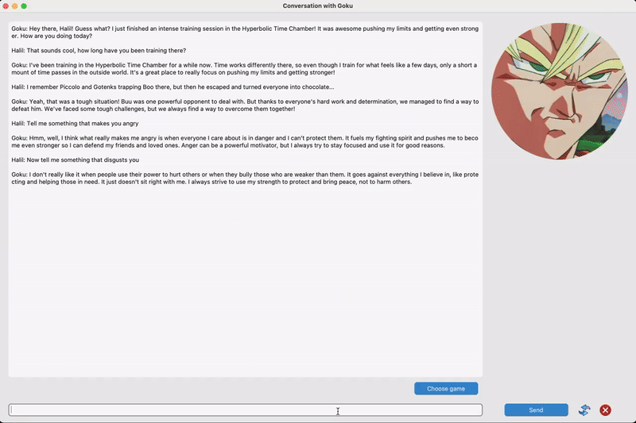

# LLM Agent System with Multi-Tier Memory Architecture

- [LLM Agent System with Multi-Tier Memory Architecture](#llm-agent-system-with-multi-tier-memory-architecture)
  - [Description](#description)
  - [System Architecture](#system-architecture)
  - [At a Glance](#at-a-glance)
  - [Technical Highlights](#technical-highlights)
    - [Features](#features)
  - [Installation](#installation)
    - [Usage](#usage)
  - [Production Considerations](#production-considerations)

---

A conversational AI system demonstrating agentic capabilities through the ReAct framework, production-grade RAG architecture, and sentiment-adaptive UI. Features local LLM deployment with GPU acceleration, ChromaDB vector store for long-term memory, and multi-model orchestration.

**Core Capabilities:**

- 🤖 Tool-using AI agent (plays Tic-Tac-Toe via external tool execution)
- 🧠 Three-tier memory: buffer + summary + vector store (RAG)
- 💬 Local LLM deployment (llama-cpp-python) or OpenAI API
- 😊 Real-time sentiment analysis with UI adaptation
- 🎭 Character-based roleplay system with emotional modeling



## Description

An experimental conversational AI system exploring agentic capabilities, multi-tier memory architecture, and local LLM deployment. Implements the ReAct framework ([original paper](https://arxiv.org/abs/2210.03629), [quick-read article](https://www.promptingguide.ai/techniques/react)) for tool-using agents with production-grade RAG architecture.

Main conversational LLM can be run locally via [llama-cpp-python](https://github.com/abetlen/llama-cpp-python) or via the OpenAI API (needs an access key). Sentiment analysis is done via a [fine-tuned DistilRoBERTa-base](https://huggingface.co/j-hartmann/emotion-english-distilroberta-base) model and run via the [HF tranformers](https://huggingface.co/docs/transformers/en/main_classes/pipelines) library.

## System Architecture


**Key Components:**

- **Agent Controller:** ReAct-based reasoning loop for tool selection and execution
- **Memory System:**
  - Short-term: Conversation buffer (last n messages)
  - Mid-term: Rolling summary of conversation history
  - Long-term: ChromaDB vector store for semantic retrieval (RAG)
- **LLM Backend:** Local deployment via llama-cpp-python with GPU acceleration
- **Tool System:** Extensible framework for external capabilities (currently: game logic, board state management)
- **Sentiment Analysis:** Secondary DistilRoBERTa model for emotion detection and UI adaptation

## At a Glance

| Component       | Technology                          |
| --------------- | ----------------------------------- |
| Agent Framework | ReAct (reasoning + acting)          |
| LLM Backend     | llama-cpp-python / OpenAI API       |
| Vector Store    | ChromaDB (RAG architecture)         |
| Sentiment Model | DistilRoBERTa-base (fine-tuned)     |
| UI Framework    | CustomTkinter                       |
| Memory Strategy | Buffer + Summary + Vector Retrieval |
| Context Window  | 4096 tokens (managed)               |

## Technical Highlights

**Production-Grade RAG Implementation:**

- ChromaDB vector store for semantic memory retrieval
- Automatic embedding and storage of conversation history
- Context-aware prompt augmentation from long-term memory

**Multi-Tier Memory Architecture:**

- Persistent storage across sessions (JSON + vector DB)
- Automatic summarization to manage context window limits
- Semantic search for relevant historical context

**Local LLM Deployment:**

- CPU/GPU hybrid inference with llama-cpp-python
- Support for quantized models (Q5_K_M) for efficiency
- 4096 token context window management

**Agentic Capabilities:**

- ReAct framework implementation for tool-using behavior
- Dynamic tool selection and execution
- Multi-step reasoning with intermediate observations

**Multi-Model Orchestration:**

- Primary LLM for conversation and reasoning
- Auxiliary sentiment analysis model (DistilRoBERTa)
- Real-time UI adaptation based on emotion detection

### Features

- Chatbot can play a game of "Tic-Tac-Toe" with you by executing tools
- Chatbot takes the role of a specific character you can choose and acts as much as possible the way that character would act
- Specific character can be anyone from movies, video games, anime etc. (see "characters.json" for a list of characters I used)
- Image of character changes based on the characters current emotion (currently only implemented for Goku)


## Installation

1. Clone the repository:

```
git clone https://github.com/hzabun/llm-agent-desktop-gui
cd llm-agent-desktop-gui
```

2. Create and activate a virtual environment

```
# For MacOS and Unix
python3 -m venv venv
source venv/bin/activate

# For Windows
python -m venv venv
.\venv\Scripts\activate
```

3. Install dependencies:

```
pip install -r requirements.txt
```

4. Install [llama-cpp-python](https://github.com/abetlen/llama-cpp-python)

   - Follow the custom installation instructions for your machine
   - Alternatively use an OpenAI API key by adding "openai" [here](https://github.com/hzabun/llm-agent-desktop-gui/blob/main/src/llm_agent_gui/agent.py#L24)

5. Download an LLM and save it under _src/llm_agent_gui/llm_weights_
   - I used [Openhermes 2.5 Mistral 7B - GGUF](https://huggingface.co/TheBloke/OpenHermes-2.5-Mistral-7B-GGUF)
   - Make sure to update the path name to your LLM in **llm_backend.py** [here](https://github.com/hzabun/llm-agent-desktop-gui/blob/main/src/llm_agent_gui/llm_backend.py#L26)
   - Tip: 7B models seem to struggle a bit with following ReAct format, bigger models recommended

### Usage

Run main.py

```
python main.py
```

Engage with the character, change character if you like and play a game of Tic-Tac-Toe. All conversation is saved locally.

## Production Considerations

As an experimental system, several areas would benefit from hardening for production deployment:

- **LLM output parsing:** Implement structured output validation for ReAct format compliance
- **Error recovery:** Add retry logic for malformed LLM responses during tool execution
- **Monitoring:** Add observability layer for tracking agent decision paths and tool usage
- **Scalability:** Evaluate vector DB performance at scale and implement caching strategies
